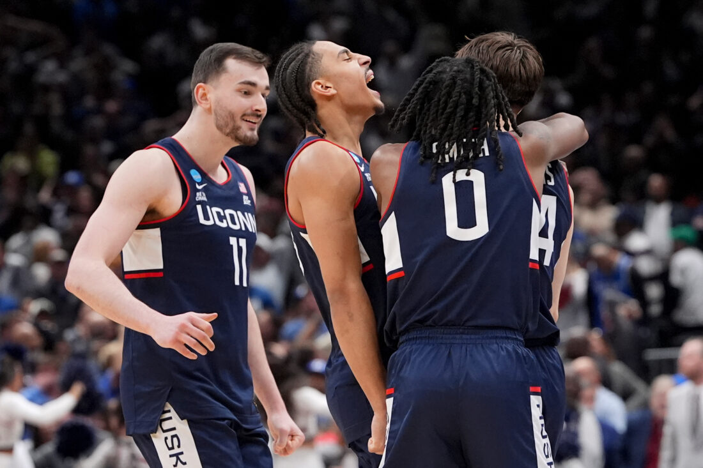
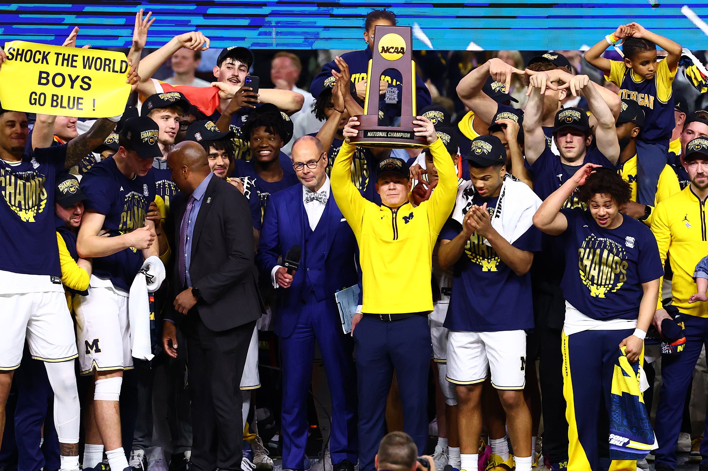

**Post 6**

```{r}
#| include: false
library(tidyverse)
library(hoopR)
library(MMBracketR)
library(plotly) 

mbb_pbp <-  hoopR::load_mbb_pbp(seasons = 2026)

# Neutral Win Prob Plots
duke_uconn_db_neutral <- read_csv("duke_uconn_db_neutral.csv")
mich_uconn_db_neutral <- read_csv("mich_uconn_db_neutral.csv")

duke_uconn_db_neutral <- duke_uconn_db_neutral |>
  mutate(win_prob_neutral = if_else(time_elapsed == 2400, 0, win_prob_neutral))

mich_uconn_db_neutral <- mich_uconn_db_neutral |>
  mutate(win_prob_neutral = if_else(time_elapsed == 2400, 1, win_prob_neutral))

plot_duke_uconn_neutral <- ggplot(duke_uconn_db_neutral, aes(x = time_elapsed, y = win_prob_neutral)) +
  geom_line(linewidth = 0.4) +
  geom_vline(xintercept = 1200, linetype = "dashed", color = "gray") +
  scale_x_continuous(breaks = seq(0, 2400, by = 300)) +
  scale_y_continuous(limits = c(0, 1)) +
  labs(title = "Duke vs UConn Dynamic Bayes Win Probability",
       x = "Time Elapsed (seconds)",
       y = "Predicted Win Probability (Duke)") +
  theme_minimal(base_size = 14)

plot_mich_uconn_neutral <- ggplot(mich_uconn_db_neutral, aes(x = time_elapsed, y = win_prob_neutral)) +
  geom_line(linewidth = 0.4) +
  geom_vline(xintercept = 1200, linetype = "dashed", color = "gray") +
  scale_x_continuous(breaks = seq(0, 2400, by = 300)) +
  scale_y_continuous(limits = c(0, 1)) +
  labs(title = "Michigan vs UConn Dynamic Bayes Win Probability",
       x = "Time Elapsed (seconds)",
       y = "Predicted Win Probability (Michigan)") +
  theme_minimal(base_size = 14)


# Duke vs UConn Plotly
duke_uconn_scores_raw <- mbb_pbp |>
  filter(game_id == "401856577") |>
  mutate(time_elapsed = 2400 - end_game_seconds_remaining) |>
  select(time_elapsed, home_score, away_score) |>
  arrange(time_elapsed) |>
  group_by(time_elapsed) |>
  slice_tail(n = 1) |>
  ungroup()

duke_uconn_db_scores <- duke_uconn_db_neutral |>
  left_join(duke_uconn_scores_raw, by = "time_elapsed") |>
  fill(home_score, away_score, .direction = "down") |>
  mutate(
    Score = paste0(
      "<span style='color:#00539B'>Duke: ", home_score, "</span> | ",
      "<span style='color:#E4002B'>UConn: ", away_score, "</span>"
    )
  )

plotly_duke_uconn_neutral <- ggplot(duke_uconn_db_scores, aes(x = time_elapsed, y = win_prob_neutral, label = Score)) +
  geom_line(linewidth = 0.4) +
  geom_vline(xintercept = 1200, linetype = "dashed", color = "gray") +
  scale_x_continuous(breaks = seq(0, 2400, by = 300)) +
  scale_y_continuous(limits = c(0, 1)) +
  labs(title = "Duke vs UConn Dynamic Bayes Win Probability",
       x = "Time Elapsed (seconds)",
       y = "Predicted Win Probability (Duke)") +
  theme_minimal(base_size = 14)


# Michigan vs UConn Plotly
mich_uconn_scores_raw <- mbb_pbp |>
  filter(game_id == "401856600") |>
  mutate(time_elapsed = 2400 - end_game_seconds_remaining) |>
  select(time_elapsed, home_score, away_score) |>
  arrange(time_elapsed) |>
  group_by(time_elapsed) |>
  slice_tail(n = 1) |>
  ungroup()

mich_uconn_db_scores <- mich_uconn_db_neutral |>
  left_join(mich_uconn_scores_raw, by = "time_elapsed") |>
  fill(home_score, away_score, .direction = "down") |>
  mutate(
    Score = paste0(
      "<span style='color:#ffcb05'>Michigan: ", home_score, "</span> | ",
      "<span style='color:#E4002B'>UConn: ", away_score, "</span>"
    )
  )

plotly_mich_uconn_neutral <- ggplot(mich_uconn_db_scores, aes(x = time_elapsed, y = win_prob_neutral, label = Score)) +
  geom_line(linewidth = 0.4) +
  geom_vline(xintercept = 1200, linetype = "dashed", color = "gray") +
  scale_x_continuous(breaks = seq(0, 2400, by = 300)) +
  scale_y_continuous(limits = c(0, 1)) +
  labs(title = "Michigan vs UConn Dynamic Bayes Win Probability",
       x = "Time Elapsed (seconds)",
       y = "Predicted Win Probability (Michigan)") +
  theme_minimal(base_size = 14)

# Tournament Bracket
# First Round
bracket <- plotTourn(games = 64) +
  # 2. Add professional styling to match your win probability plots
  theme_void() + 
  theme(
    panel.background = element_rect(fill = "white", color = NA),
    plot.background = element_rect(fill = "white", color = NA),
    plot.title = element_text(hjust = 0.5, face = "bold", size = 16, margin = margin(b = 10))
  ) +
  labs(title = "2026 NCAA Tournament Bracket")

bracket$layers <- purrr::keep(bracket$layers, ~ !inherits(.x$geom, "GeomText"))

# 3. Use annotate() to layer team names onto the canvas segments
# (You can tweak the X/Y coordinates to place them exactly on the lines)
bracket_first_round <- bracket +
  # East Region
  annotate("text", x = 0.5, y = 32.3, 
           label = "Duke (1)", size = 1.5, 
           fontface = "bold", color = "black") +
  annotate("text", x = 0.5, y = 31.3, 
           label = "Sienna (16)", size = 1.5, color = "black") +
  annotate("text", x = 0.5, y = 30.3, 
           label = "Ohio St. (8)", size = 1.5, color = "black") +
  annotate("text", x = 0.5, y = 29.3, 
           label = "TCU (9)", size = 1.5, 
           fontface = "bold", color = "black") +
  annotate("text", x = 0.5, y = 28.3, 
           label = "St. John's (5)", size = 1.5, 
           fontface = "bold", color = "black") +
  annotate("text", x = 0.5, y = 27.3, 
           label = "Northern Iowa (12)", size = 1.5, color = "black") +
  annotate("text", x = 0.5, y = 26.3, 
           label = "Kansas (4)", size = 1.5, 
           fontface = "bold", color = "black") +
  annotate("text", x = 0.5, y = 25.3, 
           label = "Cal Baptist (13)", size = 1.5, color = "black") +
  annotate("text", x = 0.5, y = 24.3, 
           label = "Louisville (6)", size = 1.5, 
           fontface = "bold", color = "black") +
  annotate("text", x = 0.5, y = 23.3, 
           label = "South Florida (11)", size = 1.5, color = "black") +
  annotate("text", x = 0.5, y = 22.3, 
           label = "Michigan St. (3)", size = 1.5, 
           fontface = "bold", color = "black") +
  annotate("text", x = 0.5, y = 21.3, 
           label = "NDSU (14)", size = 1.5, color = "black") +
  annotate("text", x = 0.5, y = 20.3, 
           label = "UCLA (7)", size = 1.5, 
           fontface = "bold", color = "black") +
  annotate("text", x = 0.5, y = 19.3, 
           label = "UCF (10)", size = 1.5, color = "black") +
  annotate("label", x = 0.5, y = 18.3, 
           label = "UConn (2)", size = 1.5, 
           fontface = "bold", color = "black", fill = "#5CCEFF") +
  annotate("text", x = 0.5, y = 17.3, 
           label = "Furman (15)", size = 1.5, 
           fontface = "bold", color = "black") +
  
  # South Region
  annotate("text", x = 0.5, y = 16.3, 
           label = "Flordia (1)", size = 1.5, 
           fontface = "bold", color = "black") +
  annotate("text", x = 0.5, y = 15.3, 
           label = "Prairie View A&M (16)", size = 1.5, color = "black") +
  annotate("text", x = 0.5, y = 14.3, 
           label = "Clemson (8)", size = 1.5, color = "black") +
  annotate("text", x = 0.5, y = 13.3, 
           label = "Iowa (9)", size = 1.5, 
           fontface = "bold", color = "black") +
  annotate("text", x = 0.5, y = 12.3, 
           label = "Vanderbilt (5)", size = 1.5, 
           fontface = "bold", color = "black") +
  annotate("text", x = 0.5, y = 11.3, 
           label = "McNeese (12)", size = 1.5, color = "black") +
  annotate("text", x = 0.5, y = 10.3, 
           label = "Nebraska (4)", size = 1.5, 
           fontface = "bold", color = "black") +
  annotate("text", x = 0.5, y = 9.3, 
           label = "Troy (13)", size = 1.5, color = "black") +
  annotate("text", x = 0.5, y = 8.3, 
           label = "UNC (6)", size = 1.5, color = "black") +
  annotate("text", x = 0.5, y = 7.3, 
           label = "VCU (11)", size = 1.5, 
           fontface = "bold", color = "black") +
  annotate("text", x = 0.5, y = 6.3, 
           label = "Illinois (3)", size = 1.5, 
           fontface = "bold", color = "black") +
  annotate("text", x = 0.5, y = 5.3, 
           label = "Penn (14)", size = 1.5, color = "black") +
  annotate("text", x = 0.5, y = 4.3, 
           label = "Saint Mary's (7)", size = 1.5, color = "black") +
  annotate("text", x = 0.5, y = 3.3, 
           label = "Texas A&M (10)", size = 1.5, 
           fontface = "bold", color = "black") +
  annotate("text", x = 0.5, y = 2.3, 
           label = "Houston (2)", size = 1.5, 
           fontface = "bold", color = "black") +
  annotate("text", x = 0.5, y = 1.3, 
           label = "Idaho (15)", size = 1.5, 
           fontface = "bold", color = "black") +
  
  # West Region
  annotate("text", x = 9.5, y = 32.3, 
           label = "Arizona (1)", size = 1.5, 
           fontface = "bold", color = "black") +
  annotate("text", x = 9.5, y = 31.3, 
           label = "Long Island (16)", size = 1.5, color = "black") +
  annotate("text", x = 9.5, y = 30.3, 
           label = "Villanova (8)", size = 1.5, color = "black") +
  annotate("text", x = 9.5, y = 29.3, 
           label = "Utah St. (9)", size = 1.5, 
           fontface = "bold", color = "black") +
  annotate("text", x = 9.5, y = 28.3, 
           label = "Wisconsin (5)", size = 1.5, color = "black") +
  annotate("text", x = 9.5, y = 27.3, 
           label = "High Point (2)", size = 1.5, 
           fontface = "bold", color = "black") +
  annotate("text", x = 9.5, y = 26.3, 
           label = "Arkansas (4)", size = 1.5, 
           fontface = "bold", color = "black") +
  annotate("text", x = 9.5, y = 25.3, 
           label = "Hawaii (13)", size = 1.5, color = "black") +
  annotate("text", x = 9.5, y = 24.3, 
           label = "BYU (6)", size = 1.5, color = "black") +
  annotate("text", x = 9.5, y = 23.3, 
           label = "Texas (11)", size = 1.5, 
           fontface = "bold", color = "black") +
  annotate("text", x = 9.5, y = 22.3, 
           label = "Gonazaga (3)", size = 1.5, 
           fontface = "bold", color = "black") +
  annotate("text", x = 9.5, y = 21.3, 
           label = "Kennesaw St. (14)", size = 1.5, color = "black") +
  annotate("text", x = 9.5, y = 20.3, 
           label = "Miami FL (7)", size = 1.5, 
           fontface = "bold", color = "black") +
  annotate("text", x = 9.5, y = 19.3, 
           label = "Missouri (10)", size = 1.5, color = "black") +
  annotate("text", x = 9.5, y = 18.3, 
           label = "Purdue (2)", size = 1.5, 
           fontface = "bold", color = "black") +
  annotate("text", x = 9.5, y = 17.3, 
           label = "Queens (15)", size = 1.5, color = "black") +
  
  # Midwest Region
  annotate("label", x = 9.5, y = 16.3, 
           label = "Michigan (1)", size = 1.5, 
           fontface = "bold", color = "black", fill = "#5CCEFF") +
  annotate("text", x = 9.5, y = 15.3, 
           label = "Howard (16)", size = 1.5, color = "black") +
  annotate("text", x = 9.5, y = 14.3, 
           label = "Georgia (8)", size = 1.5, color = "black") +
  annotate("text", x = 9.5, y = 13.3, 
           label = "Saint Louis (9)", size = 1.5, 
           fontface = "bold", color = "black") +
  annotate("text", x = 9.5, y = 12.3, 
           label = "Texas Tech (5)", size = 1.5, 
           fontface = "bold", color = "black") +
  annotate("text", x = 9.5, y = 11.3, 
           label = "Akron (12)", size = 1.5, color = "black") +
  annotate("text", x = 9.5, y = 10.3, 
           label = "Alabama (4)", size = 1.5, 
           fontface = "bold", color = "black") +
  annotate("text", x = 9.5, y = 9.3, 
           label = "Hofstra (13)", size = 1.5, color = "black") +
  annotate("text", x = 9.5, y = 8.3, 
           label = "Tennessee (6)", size = 1.5, 
           fontface = "bold", color = "black") +
  annotate("text", x = 9.5, y = 7.3, 
           label = "Miami OH (11)", size = 1.5, color = "black") +
  annotate("text", x = 9.5, y = 6.3, 
           label = "Virginia (3)", size = 1.5, 
           fontface = "bold", color = "black") +
  annotate("text", x = 9.5, y = 5.3, 
           label = "Wright St. (14)", size = 1.5, color = "black") +
  annotate("text", x = 9.5, y = 4.3, 
           label = "Kentucky (7)", size = 1.5, 
           fontface = "bold", color = "black") +
  annotate("text", x = 9.5, y = 3.3, 
           label = "Santa Clara (10)", size = 1.5, color = "black") +
  annotate("text", x = 9.5, y = 2.3, 
           label = "Iowa St. (2)", size = 1.5, 
           fontface = "bold", color = "black") +
  annotate("text", x = 9.5, y = 1.3, 
           label = "Tennessee St. (15)", size = 1.5, color = "black")

# Second Round
bracket_second_round <- bracket_first_round +
  # East Region
  annotate("text", x = 1.5, y = 31.8, 
           label = "Duke (1)", size = 1.5, 
           fontface = "bold", color = "black") +
  annotate("text", x = 1.5, y = 29.8, 
           label = "TCU (9)", size = 1.5, color = "black") +
  annotate("text", x = 1.5, y = 27.8, 
           label = "St. John's (5)", size = 1.5, 
           fontface = "bold", color = "black") +
  annotate("text", x = 1.5, y = 25.8, 
           label = "Kansas (4)", size = 1.5, color = "black") +
  annotate("text", x = 1.5, y = 23.8, 
           label = "Louisville (6)", size = 1.5, color = "black") +
  annotate("text", x = 1.5, y = 21.8, 
           label = "Michigan St. (3)", size = 1.5, 
           fontface = "bold", color = "black") +
  annotate("text", x = 1.5, y = 19.8, 
           label = "UCLA (7)", size = 1.5, color = "black") +
  annotate("label", x = 1.5, y = 17.8, 
           label = "UConn (2)", size = 1.5, 
           fontface = "bold", color = "black", fill = "#5CCEFF") +
  
  # South Region
  annotate("text", x = 1.5, y = 15.8, 
           label = "Florida (1)", size = 1.5, color = "black") +
  annotate("text", x = 1.5, y = 13.8, 
           label = "Iowa (9)", size = 1.5, 
           fontface = "bold", color = "black") +
  annotate("text", x = 1.5, y = 11.8, 
           label = "Vanderbilt (5)", size = 1.5, color = "black") +
  annotate("text", x = 1.5, y = 9.8, 
           label = "Nebraska (4)", size = 1.5, 
           fontface = "bold", color = "black") +
  annotate("text", x = 1.5, y = 7.8, 
           label = "VCU (11)", size = 1.5, color = "black") +
  annotate("text", x = 1.5, y = 5.8, 
           label = "Illinois (2)", size = 1.5, 
           fontface = "bold", color = "black") +
  annotate("text", x = 1.5, y = 3.8, 
           label = "Texas A&M (10)", size = 1.5, color = "black") +
  annotate("text", x = 1.5, y = 1.8, 
           label = "Houston (2)", size = 1.5, 
           fontface = "bold", color = "black") +
  
  # West Region
  annotate("text", x = 8.5, y = 31.8, 
           label = "Arizona (1)", size = 1.5, 
           fontface = "bold", color = "black") +
  annotate("text", x = 8.5, y = 29.8, 
           label = "Utah St. (9)", size = 1.5, color = "black") +
  annotate("text", x = 8.5, y = 27.8, 
           label = "High Point (12)", size = 1.5, color = "black") +
  annotate("text", x = 8.5, y = 25.8, 
           label = "Arkansas (4)", size = 1.5, 
           fontface = "bold", color = "black") +
  annotate("text", x = 8.5, y = 23.8, 
           label = "Texas (11)", size = 1.5, 
           fontface = "bold", color = "black") +
  annotate("text", x = 8.5, y = 21.8, 
           label = "Gonzaga (3)", size = 1.5, color = "black") +
  annotate("text", x = 8.5, y = 19.8, 
           label = "Miami FL (7)", size = 1.5, color = "black") +
  annotate("text", x = 8.5, y = 17.8, 
           label = "Purdue (2)", size = 1.5, 
           fontface = "bold", color = "black") +
  
  # Midwest Region
  annotate("label", x = 8.5, y = 15.8, 
           label = "Michigan (1)", size = 1.5, 
           fontface = "bold", color = "black", fill = "#5CCEFF") +
  annotate("text", x = 8.5, y = 13.8, 
           label = "Saint Louis (9)", size = 1.5, color = "black") +
  annotate("text", x = 8.5, y = 11.8, 
           label = "Texas Tech (5)", size = 1.5, color = "black") +
  annotate("text", x = 8.5, y = 9.8, 
           label = "Alabama (4)", size = 1.5, 
           fontface = "bold", color = "black") +
  annotate("text", x = 8.5, y = 7.8, 
           label = "Tennessee (6)", size = 1.5, 
           fontface = "bold", color = "black") +
  annotate("text", x = 8.5, y = 5.8, 
           label = "Virginia (3)", size = 1.5, color = "black") +
  annotate("text", x = 8.5, y = 3.8, 
           label = "Kentucky (7)", size = 1.5, color = "black") +
  annotate("text", x = 8.5, y = 1.8, 
           label = "Iowa St. (2)", size = 1.5, 
           fontface = "bold", color = "black")

# Sweet 16
bracket_sweet_16 <- bracket_second_round +
  # East Region
  annotate("text", x = 2.5, y = 30.8, 
           label = "Duke (1)", size = 1.5, 
           fontface = "bold", color = "black") +
  annotate("text", x = 2.5, y = 26.8, 
           label = "St. John's (5)", size = 1.5, color = "black") +
  annotate("text", x = 2.5, y = 22.8, 
           label = "Michigan St. (3)", size = 1.5, color = "black") +
  annotate("label", x = 2.5, y = 18.8, 
           label = "UConn (2)", size = 1.5, 
           fontface = "bold", color = "black", fill = "#5CCEFF") +
  
  # South Region
  annotate("text", x = 2.5, y = 14.8, 
           label = "Iowa (9)", size = 1.5, 
           fontface = "bold", color = "black") +
  annotate("text", x = 2.5, y = 10.8, 
           label = "Nebraska (4)", size = 1.5, color = "black") +
  annotate("text", x = 2.5, y = 6.8, 
           label = "Illinois (3)", size = 1.5, 
           fontface = "bold", color = "black") +
  annotate("text", x = 2.5, y = 2.8, 
           label = "Houston (2)", size = 1.5, color = "black") +
  
  # West Region
  annotate("text", x = 7.5, y = 30.8, 
           label = "Arizona (1)", size = 1.5, 
           fontface = "bold", color = "black") +
  annotate("text", x = 7.5, y = 26.8, 
           label = "Arkansas (4)", size = 1.5, color = "black") +
  annotate("text", x = 7.5, y = 22.8, 
           label = "Texas (11)", size = 1.5, color = "black") +
  annotate("text", x = 7.5, y = 18.8, 
           label = "Purdue (2)", size = 1.5, 
           fontface = "bold", color = "black") +
  
  # Midwest Region
  annotate("label", x = 7.5, y = 14.8, 
           label = "Michigan (1)", size = 1.5, 
           fontface = "bold", color = "black", fill = "#5CCEFF") +
  annotate("text", x = 7.5, y = 10.8, 
           label = "Alabama (4)", size = 1.5, color = "black") +
  annotate("text", x = 7.5, y = 6.8, 
           label = "Tennessee (6)", size = 1.5, 
           fontface = "bold", color = "black") +
  annotate("text", x = 7.5, y = 2.8, 
           label = "Iowa St. (2)", size = 1.5, color = "black")

# Elite 8
bracket_elite_8 <- bracket_sweet_16 +
  # East Region
  annotate("text", x = 3.5, y = 28.8, 
           label = "Duke (1)", size = 1.5, color = "black") +
  annotate("label", x = 3.5, y = 20.8, 
           label = "UConn (2)", size = 1.5, 
           fontface = "bold", color = "black", fill = "#5CCEFF") +
  
  # South Region
  annotate("text", x = 3.5, y = 12.8, 
           label = "Iowa (9)", size = 1.5, color = "black") +
  annotate("text", x = 3.5, y = 4.8, 
           label = "Illinois (3)", size = 1.5, 
           fontface = "bold", color = "black") +
  
  # West Region
  annotate("text", x = 6.5, y = 28.8, 
           label = "Arizona (1)", size = 1.5, 
           fontface = "bold", color = "black") +
  annotate("text", x = 6.5, y = 20.8, 
           label = "Purdue (2)", size = 1.5, color = "black") +
  
   # Midwest Region
  annotate("label", x = 6.5, y = 12.8, 
           label = "Michigan (1)", size = 1.5, 
           fontface = "bold", color = "black", fill = "#5CCEFF") +
  annotate("text", x = 6.5, y = 4.8, 
           label = "Tennessee (6)", size = 1.5, color = "black")

# Final 4
bracket_final_4 <- bracket_elite_8 +
  annotate("label", x = 4.5, y = 24.8, 
           label = "UConn (2)", size = 1.5, 
           fontface = "bold", color = "black", fill = "#5CCEFF") +
  annotate("text", x = 4.5, y = 8.8, 
           label = "Illinois (3)", size = 1.5, color = "black") +
  annotate("text", x = 5.5, y = 24.8, 
           label = "Arizona (1)", size = 1.5, color = "black") +
  annotate("label", x = 5.5, y = 8.8, 
           label = "Michigan (1)", size = 1.5, 
           fontface = "bold", color = "black", fill = "#5CCEFF")

# Championship Bracket
bracket_championship <- bracket_final_4 +
  # Centered Title at the top-middle of the canvas
  annotate("text", x = 5.0, y = 18, label = "Championship", 
           size = 4, fontface = "bold", color = "black") +
  
  # Left finalist line
  geom_segment(aes(x = 3.5, y = 15.5, xend = 4.8, yend = 15.5), color = "black", linewidth = 0.4) +
  # Right finalist line
  geom_segment(aes(x = 5.2, y = 15.5, xend = 6.5, yend = 15.5), color = "black", linewidth = 0.4) +
  
  # Place the final team names floating directly above those new lines
  annotate("label", x = 4.15, y = 16, label = "UConn (2)", size = 1.8, color = "black", fill = "#5CCEFF") +
  annotate("label", x = 5.85, y = 16, label = "Michigan (1)", size = 1.8, fontface = "bold", color = "black", fill = "#5CCEFF")
```


## 2026 March Madness Tournament

:::{.case-study-intro}

The NCAA Men's Basketball Tournament, commonly known as March Madness, is one of the most popular sporting events in the United States. Each year, 68 teams compete in a single-elimination tournament for the opportunity to be crowned the national champions. The tournament's structure creates a highly competitive and exciting environment where a single game determines whether a team's season continues or comes to an end.

The 2026 National Championship game featured Michigan and UConn, two programs that won the first five rounds of tournament play to reach the final round and game of the season. Both teams earned their place in the championship through a combination of strong regular-season performances and success against high-quality opponents throughout the tournament.

While the final score determines the national champion, but it does not fully describe how the game unfolded. Throughout a basketball game, the likelihood of each team winning changes as points are scored, possessions are exchanged, and time expires. These changes provide additional insight into the most important moments of a game and how momentum shifted between the competing teams.

This project examines the 2026 National Championship game through the use of **in-game win probability**. A Dynamic Bayesian model is used to estimate each team's probability of winning at every point in the game. The model combines information available before tipoff with game events as they occur, continuously updating the estimated chances of victory. By tracking these probabilities over time, we can better understand how the game developed and identify the moments that had the greatest impact on the eventual outcome. Read more about the Dynamic Bayesian model [here](https://cooperolney.github.io/Fellowship-Final-Report/posts/03_mle_db/).

:::

:::{.cr-section}

[The bracket below shows the 2026 NCAA Men's Basketball Tournament beginning with the First Round. The number next to each team is its tournament seed, with lower numbers generally representing stronger teams. Bolded teams indicate the winner of each matchup, while Michigan and UConn are highlighted because they are the focus of this analysis. The tournament bracket is divided into four regions and it doesn't include the First Four play-in games that occurred before the official bracket began.]{.cr-bubble} @cr-bracket-first

[After the First Round, the field was reduced from 64 teams to 32. While many higher-seeded teams advanced as expected, several lower-seeded teams upset their opponents and busted many brackets. Michigan and UConn both won their games by double digits and moved one step closer to the National Championship.]{.cr-bubble} @cr-bracket-second

[By the Sweet 16 there were officially zero perfect brackets remaining. Texas is the last double-digit seed remaining in the tournament. At this stage, every game featured talented opponents and small margins often separated victory from defeat. Michigan easily win again, and UConn narrowly beat Michigan St. to continue their tournament run.]{.cr-bubble} @cr-bracket-sweet

[The Elite Eight determines which teams will earn a trip to the Final Four. Both Michigan and UConn entered this round just one victory away from college basketball's biggest stage. While Michigan advanced comfortably, UConn's matchup with Duke produced one of the most dramatic games of the tournament.]{.cr-bubble} @cr-bracket-elite

[Before continuing to the Final Four, let's take a closer look at UConn's Elite Eight matchup against Duke. Although UConn ultimately advanced, the game featured lead changes that dramatically changed each team's chances of winning. Using the Dynamic Bayes win probability model, we can see how those pivotal moments unfolded throughout the game.]{.cr-bubble} [@cr-bracket-elite]{pan-to="25%,50%" scale-by="2.5"}

:::{#cr-bracket-first}
```{r}
#| echo: false
#| warning: false
bracket_first_round
```

:::

:::{#cr-bracket-second}
```{r}
#| echo: false
#| warning: false
bracket_second_round
```

:::

:::{#cr-bracket-sweet}
```{r}
#| echo: false
#| warning: false
bracket_sweet_16
```

:::

:::{#cr-bracket-elite}
```{r}
#| echo: false
#| warning: false
bracket_elite_8
```

:::

:::


# Duke vs UConn - 2026 Elite Eight

:::{.case-study-intro}
To estimate in-game win probability, a Dynamic Bayesian model was trained using play-by-play data from the 2025 NCAA Men's Basketball season. The model learns how factors such as score differential and time elapsed influence the likelihood of a team winning. As a game progresses, the model continuously updates its estimate whenever new information becomes available, producing a second-by-second view of how each team's chances change over time.

Because NCAA Tournament games are played at neutral sites, this analysis does not designate either team as the home team and does not incorporate pregame information such as team strength or betting odds. As a result, every game begins with each team assigned a 50% chance of winning. From that point forward, the win probability changes only in response to events that occur during the game itself.

The following example examines the 2026 Elite Eight matchup between Duke and UConn. Entering the game, Duke was one of the favorites to win the national championship, while UConn brought championship experience and a roster capable of competing with any team in the country. Although pregame expectations favored Duke, those expectations are intentionally excluded from the model, allowing us to focus solely on how the action on the court influenced each team's chances of victory.

:::

:::{.cr-section}

[This Elite Eight matchup featured the Duke Blue Devils and the UConn Huskies, the No. 1 and No. 2 seeds from the East Region, respectively. Since the game was played at a neutral site and the model does not incorporate team strength, both teams begin with an equal 50% chance of winning. The predicted win probability below tracks how Duke's chances evolved throughout the game based solely on the time and score.]{.cr-bubble} @cr-game-plot-01

[For much of the first half, Duke controlled the game. Efficient scoring, strong defensive possessions, and a growing lead pushed the Blue Devils' win probability steadily upward. When Duke extended its advantage to 19 points late in the half, the model estimated a 97.9% chance of victory, suggesting that a UConn comeback was highly unlikely based on historical game outcomes.]{.cr-bubble} [@cr-game-plot-01]{pan-to="0%,70%" scale-by="2.5"}

[The second half told a different story. UConn gradually erased Duke's lead, causing the predicted win probability to decline as time expired. Even after the Huskies' rally, Duke still held an estimated 85.3% chance of winning on the game's final possession. However, basketball outcomes are never certain. Freshman Braylon Mullins connected on a 35-foot buzzer-beating three-pointer, instantly shifting the game's result, and the model's final prediction from a likely Duke victory to a UConn win.]{.cr-bubble} [@cr-game-plot-01]{pan-to="-80%,5%" scale-by="1.5"}

{.cr-bubble} @cr-game-plot-01

:::{#cr-game-plot-01}
```{r}
#| echo: false
#| warning: false
ggplotly(plotly_duke_uconn_neutral, tooltip = "label") |>
  config(displayModeBar = FALSE) |>
  layout(
    hoverlabel = list(
      bgcolor = "white",
      bordercolor = "black",
      font = list(color = "black", size = 12)
    )
  )
```

<div class="cr-arrow-01">
  <svg viewBox="0 0 70 70" xmlns="http://www.w3.org/2000/svg">
    <line x1="11" y1="31.5" x2="45" y2="40" stroke="#EE6730" stroke-width="2" marker-end="url(#arrowhead)"/>
    <defs>
      <marker id="arrowhead" markerWidth="5" markerHeight="5" refX="2.5" refY="2.5" orient="auto">
        <polygon points="0 0, 5 2.5, 0 5" fill="#EE6730"/>
      </marker>
    </defs>
  </svg>
</div>

<div class="cr-arrow-02">
  <svg viewBox="0 0 70 70" xmlns="http://www.w3.org/2000/svg">
    <line x1="62.3" y1="9.6" x2="45" y2="40" stroke="#EE6730" stroke-width="2" marker-end="url(#arrowhead)"/>
    <defs>
      <marker id="arrowhead" markerWidth="5" markerHeight="5" refX="2.5" refY="2.5" orient="auto">
        <polygon points="0 0, 5 2.5, 0 5" fill="#EE6730"/>
      </marker>
    </defs>
  </svg>
</div>

:::

:::{.cr-minimap-float}

```{r}
#| echo: false
#| warning: false
minimap_duke_uconn <- plot_duke_uconn_neutral +
  annotate("rect",
    xmin = 300, xmax = 1900, ymin = 0.5, ymax = 1,
    fill = "#EE6730", alpha = 0.5
  ) +
  theme(axis.text = element_text(size = 16))

minimap_duke_uconn
```

:::

:::{.cr-minimap-float-second}

```{r}
#| echo: false
#| warning: false
minimap_duke_uconn_second <- plot_duke_uconn_neutral +
  annotate("rect",
    xmin = 1350, xmax = 2400, ymin = 0, ymax = 1,
    fill = "#EE6730", alpha = 0.5
  ) +
  theme(axis.text = element_text(size = 16))

minimap_duke_uconn_second
```

:::

:::


# The Final Four

:::{.case-study-intro}
The Duke UConn matchup provided an example of how in-game win probability can reveal the changing dynamics of a basketball game. While UConn's dramatic comeback was one of the most memorable moments of the tournament, it was only one step on the road to the National Championship.

Returning to the tournament bracket, we can follow the remaining teams through the Final Four and examine how Michigan and UConn ultimately earned the opportunity to compete for the 2026 NCAA National Championship.

:::

:::{.cr-section}

[The Final Four marked the final weekend of the NCAA Tournament, leaving only four teams with a chance to win a national championship. Michigan and UConn each advanced through challenging regional brackets to reach this stage. With a victory in their respective Final Four matchups, both teams secured a place in the National Championship and moved within one win of college basketball's ultimate prize.]{.cr-bubble} @cr-bracket-final

[After five rounds of tournament play, only Michigan and UConn remained. The championship game brought together two of the nation's top programs, each having demonstrated resilience and consistency throughout March Madness. With the tournament title on the line, the matchup provided an ideal opportunity to examine how win probability evolves in a high-stakes environment. The remainder of this case study focuses on the National Championship game and the key moments that shaped its outcome.]{.cr-bubble} [@cr-bracket-championship]{pan-to="0%,0%" scale-by="2.5"}

:::{#cr-bracket-final}
```{r}
#| echo: false
#| warning: false
bracket_final_4
```

:::

:::{#cr-bracket-championship}
```{r}
#| echo: false
#| warning: false
bracket_championship
```

:::

:::


## Michigan vs UConn - 2026 National Championship

:::{.case-study-intro}
The 2026 NCAA National Championship represented the culmination of one of the most competitive tournaments in sports. After winning five games of March Madness, Michigan and UConn emerged as the final two teams standing. While the final score ultimately determined the national champion, the predicted win probability provides a more detailed view of how the game unfolded, highlighting the moments that shifted momentum and the key stretches that defined the outcome.

To estimate in-game win probability, the same Dynamic Bayesian model was used. Since the National Championship is also played at a neutral site, neither team receives a home-court advantage and the model begins with both teams assigned a 50% chance of victory. From that point forward, changes in win probability are driven entirely by events that occur during the game.
:::

:::{.cr-section}

[The National Championship featured the Michigan Wolverines and the UConn Huskies. Michigan entered the game as the No. 1 seed from the Midwest Region and one of the most consistent teams in the country throughout the season. UConn, the No. 2 seed from the East Region, arrived after a dramatic tournament run that included an improbable comeback victory over Duke in the Elite Eight. With both teams playing their best basketball of the season, the championship matchup promised to be a closely contested battle.]{.cr-bubble} @cr-game-plot-02

[The opening half demonstrated how evenly matched these teams were. Michigan built an early five point lead and briefly appeared to take control of the game, but UConn responded with a strong stretch of play that gradually erased the deficit. As the Huskies gained momentum, Michigan's win probability steadily declined, reaching a first-half low of 39.6%.]{.cr-bubble} [@cr-game-plot-02]{pan-to="40%,-20%" scale-by="2.5"}

[Unlike the dramatic swings seen in the Duke UConn game, the second half of the championship was defined by Michigan's ability to maintain control. The Wolverines consistently held the lead, but UConn remained within striking distance. With approximately 8:30 remaining in the game, the Huskies mounted one final push and cut the deficit to five points, causing Michigan's win probability to fall to 76.2%. Although Michigan remained the statistical favorite, the outcome was not yet certain.]{.cr-bubble} [@cr-game-plot-02]{pan-to="-80%,25%" scale-by="2"}

[UConn's late rally ultimately proved to be its final challenge. Michigan responded with timely scoring, controlled possessions, and key defensive stops to prevent the Huskies from drawing any closer. As the remaining time dwindled, Michigan's win probability climbed steadily toward certainty. When the final buzzer sounded, the Wolverines had completed their championship run and secured the 2026 NCAA National Championship.]{.cr-bubble} [@cr-game-plot-02]{pan-to="-100%,50%" scale-by="2.5"}

{.cr-bubble} @cr-game-plot-02

:::{#cr-game-plot-02}

```{r}
#| echo: false
#| warning: false
ggplotly(plotly_mich_uconn_neutral, tooltip = "label") |>
  config(displayModeBar = FALSE) |>
  layout(
    hoverlabel = list(
      bgcolor = "white",
      bordercolor = "black",
      font = list(color = "black", size = 12)
    )
  )
```

<div class="cr-arrow-03">
  <svg viewBox="0 0 70 70" xmlns="http://www.w3.org/2000/svg">
    <line x1="15.2" y1="58.6" x2="45" y2="40" y2="40" stroke="#EE6730" stroke-width="2" marker-end="url(#arrowhead)"/>
    <defs>
      <marker id="arrowhead" markerWidth="5" markerHeight="5" refX="2.5" refY="2.5" orient="auto">
        <polygon points="0 0, 5 2.5, 0 5" fill="#EE6730"/>
      </marker>
    </defs>
  </svg>
</div>

<div class="cr-arrow-04">
  <svg viewBox="0 0 70 70" xmlns="http://www.w3.org/2000/svg">
    <line x1="69.6" y1="59.6" x2="45" y2="40" stroke="#EE6730" stroke-width="2" marker-end="url(#arrowhead)"/>
    <defs>
      <marker id="arrowhead" markerWidth="5" markerHeight="5" refX="2.5" refY="2.5" orient="auto">
        <polygon points="0 0, 5 2.5, 0 5" fill="#EE6730"/>
      </marker>
    </defs>
  </svg>
</div>

:::

:::{.cr-minimap-float-02}

```{r}
#| echo: false
#| warning: false
minimap_mich_uconn <- plot_mich_uconn_neutral +
  annotate("rect",
    xmin = 0, xmax = 1350, ymin = 0, ymax = 0.75,
    fill = "#EE6730", alpha = 0.5
  ) +
  theme(axis.text = element_text(size = 16))

minimap_mich_uconn

```

:::

:::{.cr-minimap-float-02-second}

```{r}
#| echo: false
#| warning: false
minimap_mich_uconn_second <- plot_mich_uconn_neutral +
  annotate("rect",
    xmin = 1300, xmax = 2400, ymin = 0.2, ymax = 1,
    fill = "#EE6730", alpha = 0.5
  ) +
  theme(axis.text = element_text(size = 16))

minimap_mich_uconn_second
```

:::

:::{.cr-minimap-float-02-third}

```{r}
#| echo: false
#| warning: false
minimap_mich_uconn_third <- plot_mich_uconn_neutral +
  annotate("rect",
    xmin = 1450, xmax = 2400, ymin = 0.33, ymax = 1,
    fill = "#EE6730", alpha = 0.5
  ) +
  theme(axis.text = element_text(size = 16))

minimap_mich_uconn_third
```

:::

:::


## Conclusion

:::{.case-study-intro}

In-game win probability provides a deeper perspective on basketball games than the final score alone. While traditional statistics describe what happened, win probability helps explain when key moments occurred and how much they influenced the outcome.

Using a Dynamic Bayesian model, win probability estimates are continuously updated throughout a game as new information becomes available. By incorporating factors such as score differential, time remaining, and possession, the model captures how each team's chances of winning evolve over time.

The games examined in this case study highlight the value of this approach. UConn's comeback against Duke demonstrated that even highly unlikely outcomes can occur, while Michigan's championship victory showed how a team can steadily build and maintain control. In both cases, the predicted win probability provided insight that would be difficult to capture from the final score alone.

Beyond this tournament, win probability models can be used to identify pivotal moments, evaluate game dynamics, and communicate complex information in an intuitive way. As a result, they have become an increasingly valuable tool in modern sports analytics.

:::


